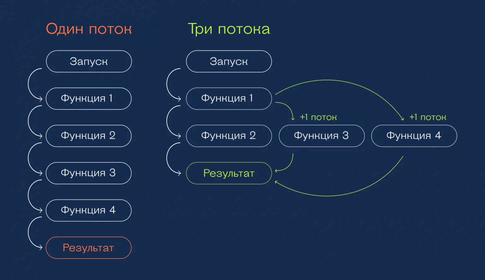
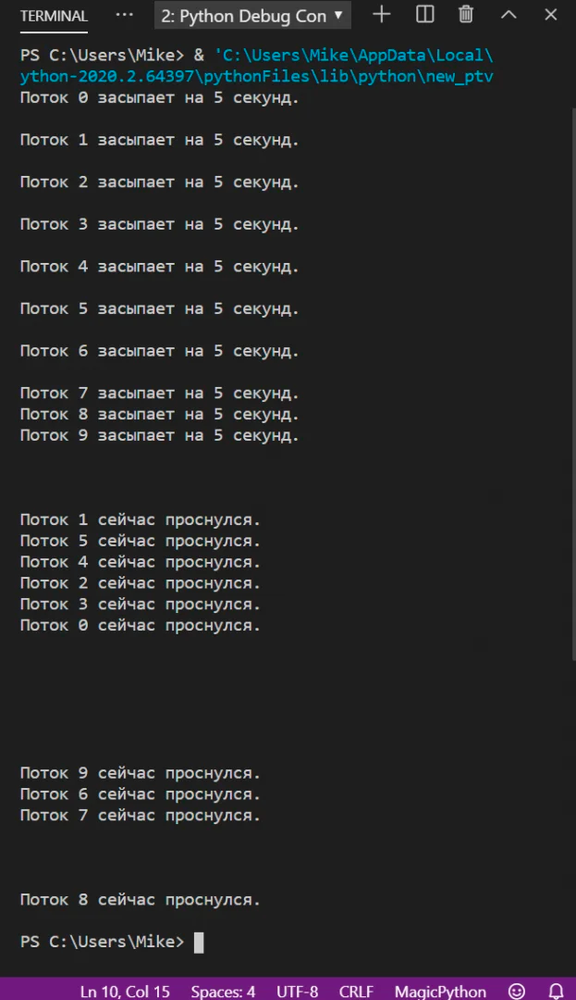

### Многопоточное программирование. Многопоточность в Python. GIL. Обмен данными между потоками. Проблемы, специфичные для многопоточных программ. Использование пулов потоков.

### Что такое поток?

В упрощённом виде потоки — это параллельно выполняемые задачи. По умолчанию используется один поток — это значит, что
программа делает всё по очереди, линейно, без возможности делать несколько дел одновременно.

Но если мы сделаем в программе два потока задач, то они будут работать параллельно и независимо друг от друга. Одному
потоку не нужно будет становиться на паузу, когда в другом что-то происходит.

👉 Важно понимать, что поток — это высокоуровневое понятие из области программирования. На уровне вашего «железа» эти
потоки всё ещё могут обсчитываться последовательно. Но благодаря тому, что они будут обсчитываться быстро, вам может
показаться, что они работают параллельно.

### Отличие от Stream

Поток (Thread) отличается от потока данных (Stream). Поток данных представляет собой непрерывный поток информации,
который передается между компонентами программы или устройствами, например, файловый поток или сетевой поток. Поток
данных обычно используется для передачи данных между различными частями программы или между программой и устройством.

### Многопоточность



- Многопоточность (multithreading) - это способность программы выполнять несколько потоков одновременно для улучшения
  производительности и эффективности исполнения задач. При использовании многопоточности, несколько потоков могут
  выполняться параллельно в рамках одного процесса.

- Многозадачность (multiprocessing) - это способность системы или программы выполнять несколько задач или процессов
  одновременно.

Отличие между многопоточностью и многозадачностью заключается в том, что многопоточность относится к выполнению
нескольких потоков в рамках одного процесса, в то время как многозадачность относится к выполнению нескольких процессов,
каждый из которых может иметь свою собственную область памяти. Эти концепции часто используются в параллельном
программировании для улучшения производительности и эффективности выполнения задач.

### Многопоточность в Python

За потоки в Python отвечает модуль threading, а сам поток можно создать с помощью класса Thread из этого модуля.
Подключается он так:

```python
from threading import Thread
```

После этого с помощью функции Thread () мы сможем создать столько потоков, сколько нам нужно. Логика работы такая:

1) Подключаем нужный модуль и класс Thread.
2) Пишем функции, которые нам нужно выполнять в потоках.
3) Создаём новую переменную — поток, и передаём в неё название функции и её аргументы. Один поток = одна функция на
   входе.
4) Делаем так столько потоков, сколько требует логика программы.
5) Потоки сами следят за тем, закончилась в них функция или нет. Пока работает функция — работает и поток.
6) Всё это работает параллельно и (в теории) не мешает друг другу.

Для иллюстрации запустим такой код:

```python
import time
from threading import Thread


def sleepMe(i):
    print("Поток %i засыпает на 5 секунд.\n" % i)
    time.sleep(5)
    print("Поток %i сейчас проснулся.\n" % i)


for i in range(10):
    th = Thread(target=sleepMe, args=(i,))
    th.start()
```

А вот как выглядит результат. Обратите внимание — потоки просыпаются не в той последовательности, как мы их запустили, а
в той, в какой их выполнил процессор. Иногда это может помешать работе программы, но про это мы поговорим отдельно в
другой статье.



```text
!------ЗАМЕЧАНИЕ -------!
Потоки — это ещё не всё
В Python кроме потоков есть ещё очереди (queue) и 
управление процессами (multiprocessing).
```

### GIL

Python Global Interpreter Lock (GIL) — блокировка, позволяющая только одному потоку управлять интерпретатором Python.
(или другими словами он представляет собой мьютекс, который блокирует доступ к объекту Python interpreter в
многопоточных средах, разрешая выполнять лишь одну инструкцию за раз.)

#### Как работает GIL

GIL - это мьютекс, который действует как ограничитель, позволяющий только одному потоку выполнять байткод Python в один
момент времени. Это означает, что в многозадачной среде Python, в один и тот же момент времени только один поток может
активно выполнять Python-код.

```python
Пример:

import threading


def worker():
    for _ in range(1000000):
        pass


# Создаем два потока
thread1 = threading.Thread(target=worker)
thread2 = threading.Thread(target=worker)

# Запускаем потоки
thread1.start()
thread2.start()

# Ждем, пока оба потока завершатся
thread1.join()
thread2.join()
```

В приведенном примере два потока выполняют функцию worker, которая просто выполняет цикл. Однако из-за GIL только один
из потоков будет активен в определенный момент времени. Это ограничение может существенно влиять на производительность,
особенно в многозадачных приложениях.

Python предоставляет встроенный модуль threading для работы с потоками. Важно отметить, что GIL существует на уровне
интерпретатора Python и не зависит от операционной системы. Поэтому, даже если ваша операционная система поддерживает
многозадачность, GIL может ограничивать использование нескольких ядер процессора.

Чтобы работать с потоками в Python, вы можете создавать экземпляры класса Thread из модуля threading и запускать их.
Важно помнить, что GIL ограничивает многозадачность на уровне интерпретатора, поэтому потоки в Python подходят для
задач, которые больше связаны с ожиданием ввода-вывода, чем с интенсивной обработкой данных.

Взаимодействие потоков с GIL может привести к неожиданным результатам, особенно если не учитывать блокировки и
многозадачность. Когда несколько потоков пытаются изменить одни и те же данные, могут возникнуть гонки данных (race
conditions).

```python
# Пример
import threading

counter = 0


def increment():
    global counter
    for _ in range(1000000):
        counter += 1


# Создаем два потока
thread1 = threading.Thread(target=increment)
thread2 = threading.Thread(target=increment)

# Запускаем потоки
thread1.start()
thread2.start()

# Ждем, пока оба потока завершатся
thread1.join()
thread2.join()

print("Counter:", counter)
```

В этом примере два потока пытаются инкрементировать общий счетчик. Вследствие блокировки GIL, результат этой операции
может быть неопределенным и зависит от того, какой поток получит доступ к счетчику в данный момент.

### Проблемы, связанные с GIL

1) Ограниченная многозадачность: Одна из наиболее известных проблем GIL - это ограничение на многозадачность. Не смотря
   на наличие множества потоков, лишь один может активно выполняться в определенный момент времени
2) Производительность многозадачных приложений: Многозадачные приложения, которые должны эффективно использовать многие
   ядра процессоров, могут столкнуться с проблемами производительности, так как GIL ограничивает параллельное
   выполнение.
3) Проблемы с вводом-выводом: GIL не так сильно ограничивает операции ввода-вывода, поэтому приложения, ориентированные
   на ожидание данных из файлов, сети и других источников, могут работать относительно нормально.
4) Сложности с разделением данных: Поделить данные между потоками может быть сложной задачей из-за GIL. Это может
   привести к гонкам данных и ошибкам.
5) Нестабильное время выполнения: Из-за конкуренции за GIL, время выполнения кода в потоках может быть непредсказуемым и
   меняться от запуска к запуску.
6) Ограничения на ресурсы: GIL также ограничивает доступ к ресурсам компьютера, таким как процессорное время, что может
   быть проблематично для многозадачных приложений.
7) Особенности на многопроцессорных системах: На многопроцессорных системах GIL может привести к неэффективному
   использованию ресурсов, так как несколько ядер могут быть неактивными.
8) Неэффективное использование многоядерных процессоров: GIL делает Python менее эффективным на многоядерных
   процессорах, так как только одно ядро может быть активным в данный момент.
9) Сложности с реализацией реальной многозадачности: Из-за GIL, реализация настоящей многозадачности в Python может быть
   более сложной и требовательной к ресурсам.
10) Сложности с параллельной обработкой данных: Параллельная обработка данных может быть затруднительной из-за GIL,
    особенно при работе с большими объемами данных.

```text
Важно понимать, что GIL - это не ошибка, а концепция, заложенная в Python
с целью обеспечения безопасности и упрощения управления памятью. 
Однако, он также создает ряд ограничений для многозадачных приложений, 
и разработчики должны учитывать его при проектировании и оптимизации кода.
```

### Способы обхода GIL

Один из наиболее эффективных способов обойти GIL - это использование многопроцессорной обработки вместо многозадачных
потоков. Поскольку каждый процесс имеет свой собственный интерпретатор Python и собственный GIL, они могут параллельно
выполняться на разных ядрах процессора.

Пример использования многопроцессинга в Python с использованием модуля multiprocessing:

```python
import multiprocessing


def worker(data):
    # Здесь происходит обработка данных
    result = data * 2
    return result


data = [1, 2, 3, 4, 5]

# Создаем пул процессов
pool = multiprocessing.Pool(processes=multiprocessing.cpu_count())

# Используем многопроцессорный пул для обработки данных
results = pool.map(worker, data)

# Завершаем пул
pool.close()
pool.join()

print("Результаты:", results)
```

Этот код создает пул процессов и использует его для параллельной обработки данных. Это позволяет эффективно использовать
многозадачность и обойти ограничения GIL.

Помимо multiprocessing, существует несколько библиотек и фреймворков, которые предоставляют более высокоуровневый доступ
к многопроцессорной обработке. Например, concurrent.futures позволяет использовать пулы потоков и процессов,
предоставляя удобный интерфейс для выполнения параллельных задач.

### Обмен данными между потоками

В Python существует несколько способов обмена данными между потоками. Некоторые из распространенных методов включают в
себя:

1. Глобальные переменные: Переменные могут быть созданы в глобальной области видимости и использоваться для обмена
   данными между потоками. Однако использование глобальных переменных может потенциально привести к проблемам
   синхронизации и избегать этого лучше использовать механизмы синхронизации.

2. Очереди (Queue): Модуль queue в Python предоставляет класс Queue для безопасного обмена данными между потоками.
   Потоки могут помещать данные в очередь (put) и извлекать данные из очереди (get), обеспечивая безопасный доступ к
   данным.

3. Очереди для многопроцессорных вычислений (multiprocessing.Queue): Для обмена данными между процессами можно
   использовать multiprocessing.Queue, который работает аналогично классу Queue, но предназначен для использования в
   многопроцессорном окружении.

4. События (Event): Модуль threading в Python предоставляет класс Event, который позволяет потокам ждать определенного
   события и сигнализировать о его возникновении.

5. Семафоры (Semaphore) и блокировки (Lock): Механизмы семафоров и блокировок могут быть использованы для синхронизации
   доступа к общим данным из разных потоков.

6. Разделяемая память (Shared Memory): В модуле multiprocessing есть возможность использовать разделяемую память для
   обмена данными между процессами.

<a href="https://javarush.com/groups/posts/2174-v-chem-raznica-mezhdu-mjhjuteksom-monitorom-i-semaforom">
 !!!---- Про семафоры и мьютексы ----!!!
</a>

### Пул потоков

Пул потоков (thread pool) – это способ управления множеством потоков, созданных для выполнения одних и тех же задач.
Вместо того, чтобы постоянно создавать и уничтожать потоки, вы можете использовать пул потоков для повторного
использования уже созданных потоков.

В Python для работы с пулом потоков можно использовать модуль concurrent.futures. Он предоставляет класс ThreadPoolExecutor, который позволяет создавать пул потоков и управлять им.

Для создания пула потоков используйте класс ThreadPoolExecutor. В качестве аргумента укажите максимальное количество потоков, которое будет использоваться в пуле.

```python
from concurrent.futures import ThreadPoolExecutor 
pool = ThreadPoolExecutor(max_workers=4)
```

Теперь у вас есть пул потоков, который может использовать до 4 потоков одновременно.
Чтобы использовать пул потоков, вызовите метод submit и передайте ему функцию, которую нужно выполнить, а также аргументы этой функции.

```python
def my_function(x, y):
    return x * y
 
future = pool.submit(my_function, 2, 3)
result = future.result()
print(result)  # Выведет 6
```

Метод submit возвращает объект Future, который представляет собой результат выполнения задачи. Чтобы получить результат, вызовите метод result у объекта Future. Если задача еще не выполнена, метод result будет блокировать выполнение программы до тех пор, пока результат не станет доступным.

### Зачем нужен пулл потоков?

Проблема, которую решает пул потоков, заключается в управлении ресурсами и эффективном использовании потоков в приложениях. Использование потоков может потреблять дорогостоящие ресурсы, такие как память и процессорное время. Создание новых потоков при каждой задаче или запросе может привести к избыточному потреблению ресурсов и уменьшить производительность приложения. Пул потоков позволяет эффективно использовать ограниченное количество потоков, создав их заранее и переиспользуя их для выполнения задач.

Идея пула потоков появилась с целью улучшения управления потоками и ресурсами в многопоточных приложениях. Создание постоянного пула заранее созданных потоков позволяет избежать издержек на создание новых потоков и управлять их жизненным циклом более эффективно. Когда появляется задача, она добавляется в очередь задач пула, и свободные потоки берут задачи из очереди и выполняют их. После завершения задачи поток возвращается в пул для дальнейшего использования. Это позволяет оптимально использовать ресурсы и улучшить производительность приложения. 

### Проблемы, специфичные для многопоточных программ.
1. Гонки данных (Race conditions): Это одна из самых распространенных проблем при работе с многопоточностью. Гонка данных возникает, когда два или более потока пытаются изменить одну и ту же общую переменную одновременно, что может привести к непредсказуемым результатам и ошибкам в работе программы.

2. Проблемы с синхронизацией: Необходимость правильной синхронизации доступа к общим ресурсам и данным между потоками может быть сложной и приводить к ошибкам, таким как блокировки, взаимные блокировки, падения производительности и дедлоки.

3. Перенасыщение потоками (Thread overloading): Создание большого количества потоков может привести к перенасыщению системы и негативно повлиять на производительность из-за излишнего переключения контекста и управления потоками.

4. Проблемы с управлением памятью: Потоки могут использовать разделяемую память, что может привести к проблемам с доступом к памяти, утечкам памяти и конфликтам при работе с памятью.

5. Сложности отладки: Отладка многопоточных программ может быть сложной из-за неопределенного поведения и зависимостей между потоками, что делает выявление и исправление ошибок более трудным.

Эти проблемы могут возникнуть не только в многопоточных программах на Python, но и в любом языке с поддержкой многопоточности. Для избежания этих проблем рекомендуется использовать методы синхронизации и средства управления потоками, а также тщательно планировать и тестировать код перед его применением в многопоточной среде.